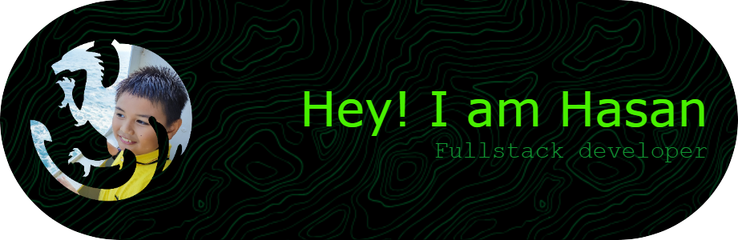

  

<h3 align="center">Front-end developer from Indonesia passionate about developing & designing.</h3>

### 💫 About Me
- 🔭 Currently working on [Play](https://github.com/Muhammad-Hasan-Web-Developer/Play.play-any-games-for-free)
- 🌱 Currently learning **PHP** and **JavaScript**
- 👨‍💻 All projects: [Portfolio Website](https://muhammmadhasan.wuaze.com)
- 📫 Email: **muhammadhasan.genju@gmail.com**

---

### 💻 Tech Stack

  
  
  

---

### 📊 GitHub Stats

  
  
  

---

### 🏆 GitHub Trophies

  

---

### 🔝 Top Contributed Repo

  

