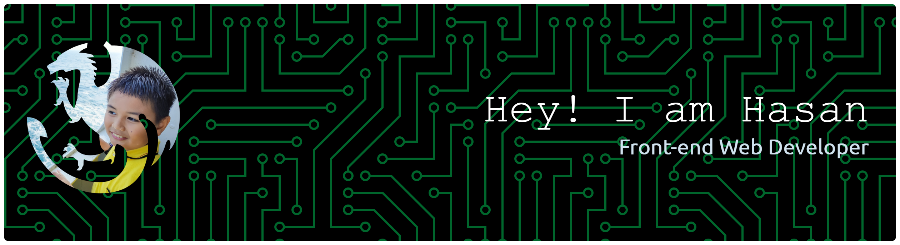

> [!NOTE]
>
> Sorry, I'm going to an Islamic boarding school, so I won't be able to use GitHub for a few years. But you can still access my GitHub.

<!-- Header -->

اَلسَّلَامُ عَلَيْكُمْ وَرَحْمَةُ اللَّهِ وَبَرَكَاتُهُ Hello, my name is Hasan. I'm 14 years old and I'm from Indonesia. I'm a front-end web developer.

### 💫 About Me
- 🔭 Currently working on ...
- 🌱 Currently learning **Blender**, **JavaScript** & **Spline**
- 👨‍💻 All projects: [My Portfolio Website]([https://muhammmadhasan.wuaze.com](https://muhammadhasan.is-a.dev/))
- 📫 Email: **muhammadhasan.genju@gmail.com**

---

### 💻 Tech Stack

  
  

---

### 📊 GitHub Stats

  
  
  

---

### 🏆 GitHub Trophies

  

---

### 🔝 Top Contributed Repo

  

